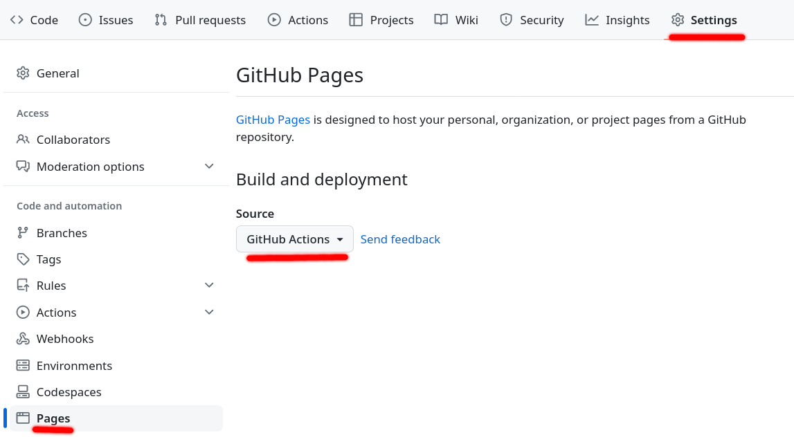

# Lean blueprints

This is a [plasTeX](https://github.com/plastex/plastex/) plugin allowing
to write blueprints for Lean 4 projects.

## Installation

This package depends on `plastexdepgraph` which requires graphviz and its development libraries. 
If you have a user-friendly OS, it is as simple as 
`sudo apt install graphviz libgraphviz-dev`. 
See https://pygraphviz.github.io/documentation/stable/install.html otherwise.

Then, assuming you have a sane python environment, you only need to run:
```
pip install git+https://github.com/PatrickMassot/leanblueprint.git@client
```
Note this will automatically install plasTeX and the other needed python
packages.

## Starting a blueprint

This package provides a command line tool `leanblueprint` that automates in
particular the creation of a blueprint for your Lean project. This tool is not
mandatory in any way. Its goal is to make it easy to create a blueprint without
worrying about choosing a file layout or a continuous integration and deployment
setup. As every one–size-fits-all tool, it is fairly opinionated. It assumes in
particular that your project repository is hosted on Github and you want to host
its blueprint on github.io.

If you don’t want to use the `leanblueprint` command line tool, you can use use
this plugin as any other plasTeX plugin, using
`plastex --plugins leanblueprint my_file.tex` (not recommended).

In order to use the `leanblueprint` tool, you need to already have a Lean
project created using lake. In addition, your blueprint will be easier to
configure if you have at least one commit in the git repository of your project
and you already configured its GitHub git remote (GitHub displays instructions
allowing to do the remote setup when you create a new repository there). You
should also tell GitHub that you want to use GitHub pages using GitHub actions.
You can do that from the GitHub page of your repository by clicking on the
Settings tab in the top menu, then the Pages link in the side menu and selecting
GitHub Actions as the source, as in the following screenshot.



Assuming your project is ready and GitHub is configured, from your project
folder run 
```
leanblueprint new
```
You will then have to answer some questions to configure your blueprint. If
unsure, accept all default answers by simply hitting Enter for each question.
Only two questions will insist on having an explicit y/n answer: the question
confirming you want to create the blueprint and the one proposing to commit
to your git repository.

After running this creation script, you can push to GitHub and wait
for GitHub Actions to build your blueprint. You can monitor this task 
in the Actions tab of the GitHub page of your repository. 
When building is done, the html version of your blueprint will be deployed to 
`https://user_name.github.io/repo_name/blueprint/` (with the appropriate
user or organization name and repository name). The pdf version will be at 
`https://user_name.github.io/repo_name/blueprint.pdf`.
The API documentation will be at `https://user_name.github.io/repo_name/docs/`.

## Local compilation

Assuming you used the `leanblueprint` command line tool to create your blueprint
(or at least that you use the same file layout), you can use `leanblueprint` to
build your blueprint locally. The available commands are:

* `leanblueprint pdf` to build the pdf version (this requires a TeX installation
  of course).
* `leanblueprint web` to build the web version
* `leanblueprint checkdecls` to check that every Lean declaration name that appear
  in the blueprint exist in the project (or in a dependency of the project such
  as Mathlib). This requires a compiled Lean project, so make sure to run `lake build` beforehand.
* `leanblueprint all` to run the previous three commands.
* `leanblueprint serve` to start a local webserver showing your local blueprint
  (this sounds silly but web browsers paranoia makes it impossible to simply
  open the generated html pages without serving them).

## Editing the blueprint

Assuming you used the `leanblueprint` command line tool to create your blueprint
(or at least that you use the same file layout), the source of your blueprint
will be in the `blueprint/src` subfolder of you Lean project folder.

Here you will find two main TeX files: `web.tex` and `print.tex`. The first one
is intended for plasTeX while the second one is intended for a traditional TeX
compiler such as `xelatex` or `lualatex` (or even `pdflatex` if you are stuck in
the 90’s). Each of then includes `macros/common.tex` for all TeX macros which
make sense for both kinds of outputs (this should be most of your macros). 
Macros that should behave differently depending on the target format should go
to either `macros/web.tex` or `macros/print.tex`. All those files already exist
and contains comments reminding you about the above explanations.

The main content of your blueprint should live in `content.tex` (or in files
imported in `content.tex` if you want to split your content).

The main TeX macros that relate your TeX code to your Lean code are:

* `\lean` that lists the Lean declaration names corresponding to the surrounding
  definition or statement (including namespaces).
* `\leanok` which claims the surrounding environment is fully formalized. Here
  an environment could be either a definition/statement or a proof.
* `\uses` that lists LaTeX labels that are used in the surrounding environment.
  This information is used to create the dependency graph. Here
  an environment could be either a definition/statement or a proof, depending on
  whether the referenced labels are necessary to state the definition/theorem
  or only in the proof.

The above macros are by far the most important, but there are a couple more.

* `\notready` which claims the surrounding environment is not ready to be formalized,
  typically because it requires more blueprint work.
* `\discussion` gives a GitHub issue number where the surrounding definition or
  statement is discussed.
* `\proves` inside a proof environement gives the LaTeX label of the LaTeX
  statement being proved. This is necessary only when the proof does not
  immediately follow the statement.
